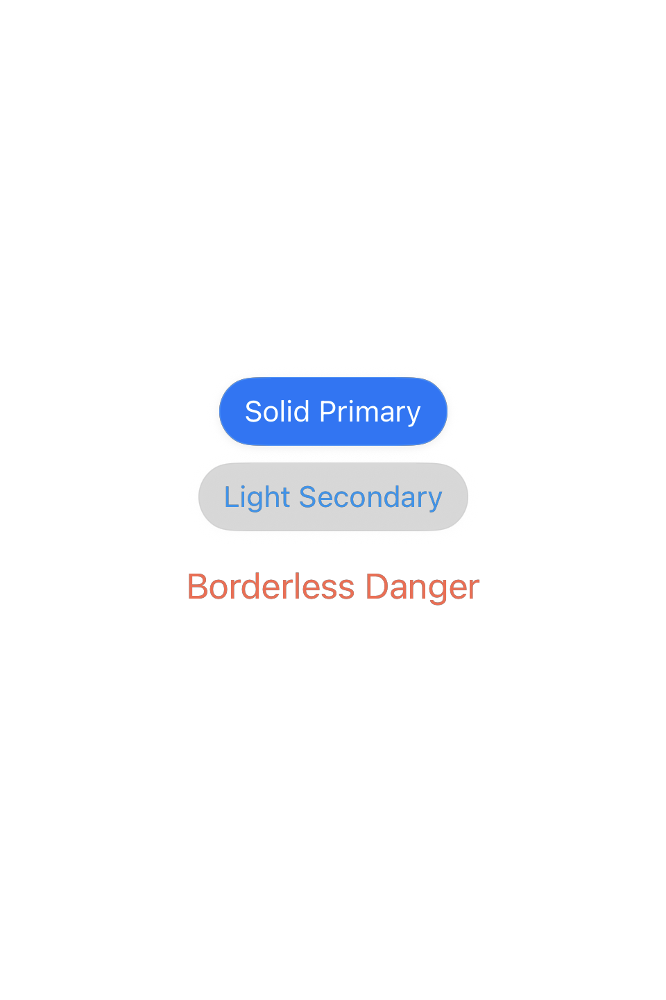
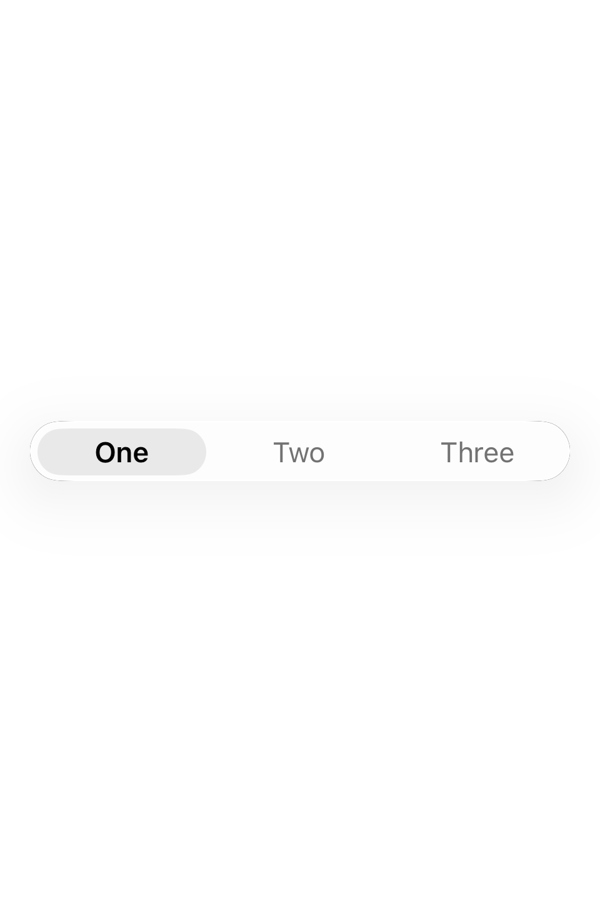
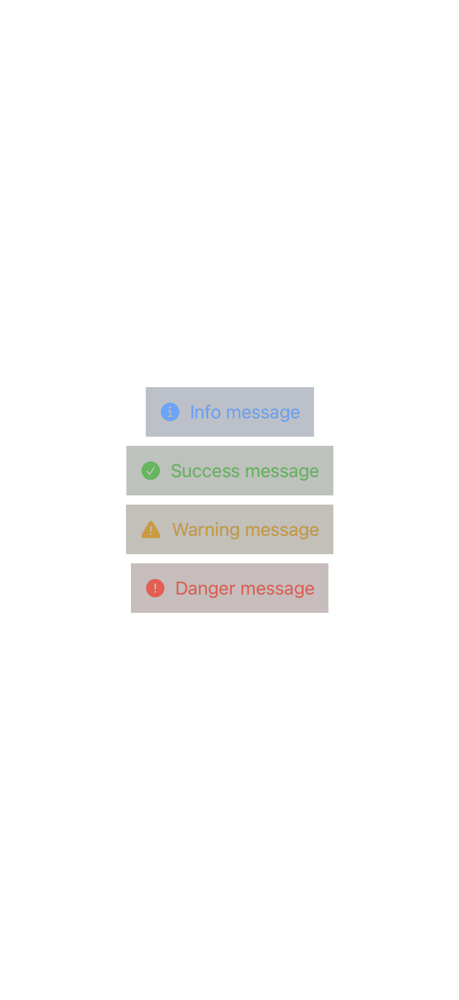
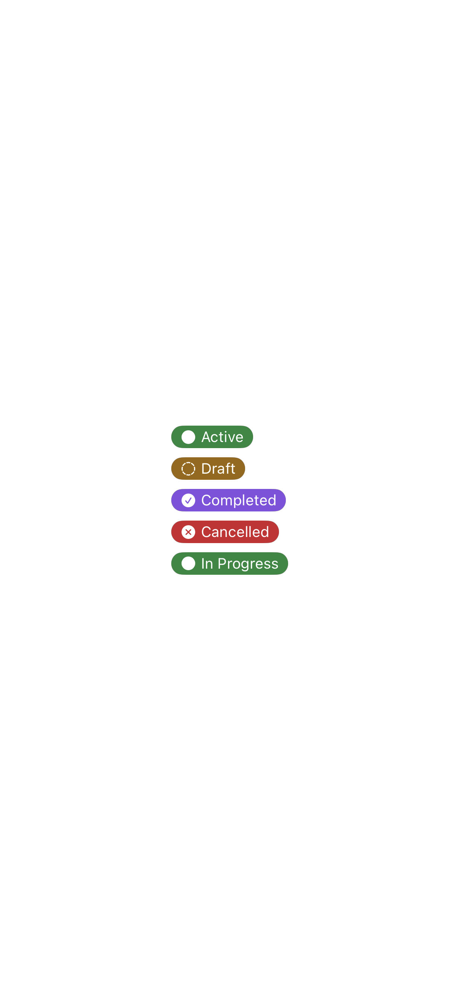
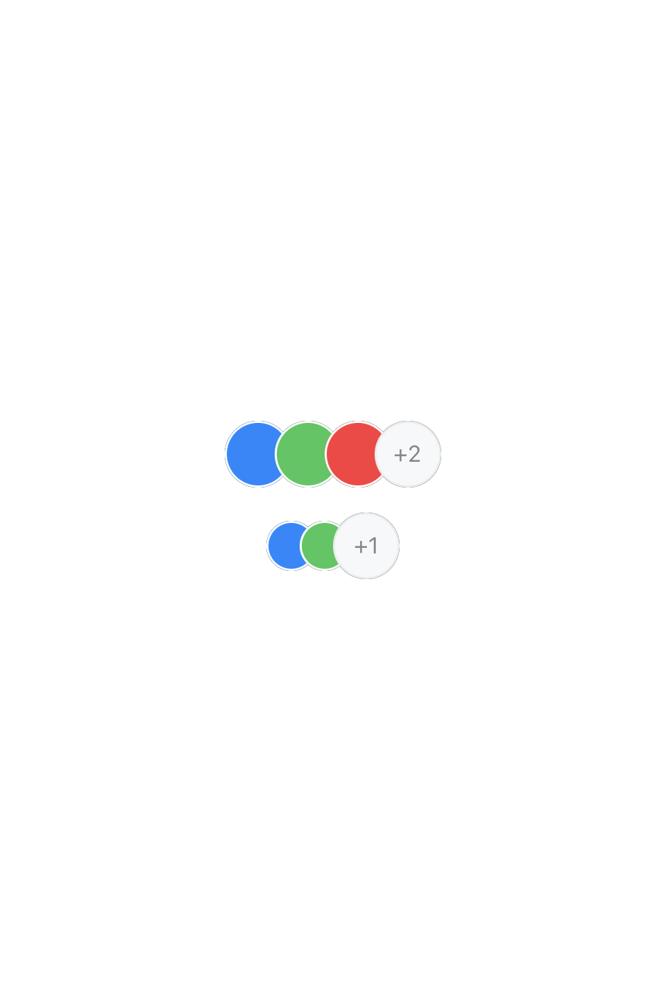
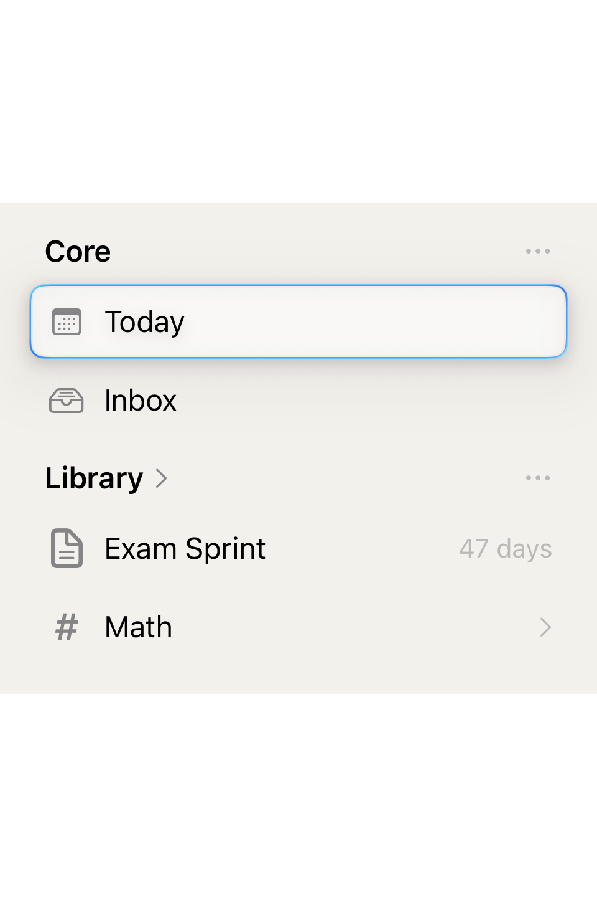
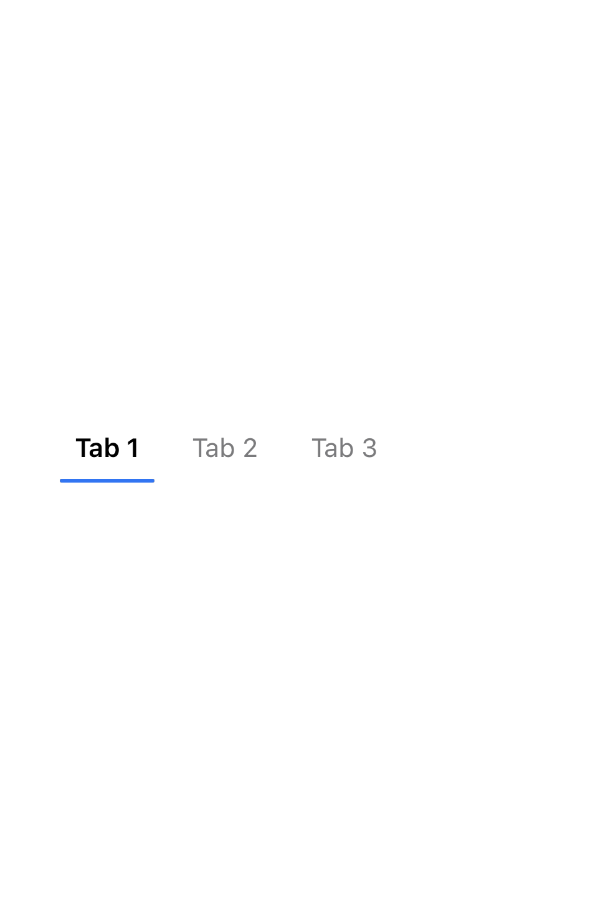
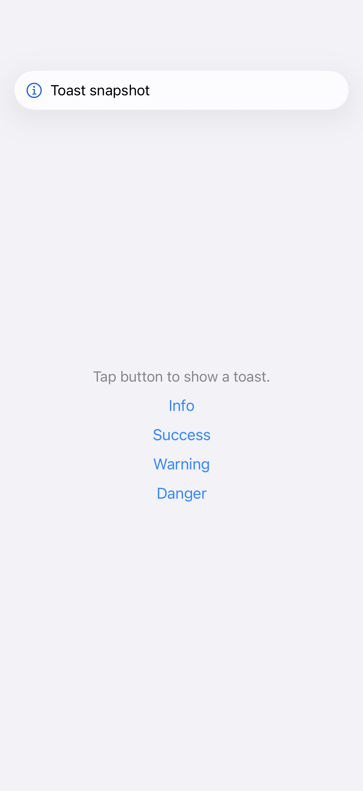

# CoreDesign 组件库 / Component Library

iOS 26+ / macOS 26+ SwiftUI 设计系统，含 18 个 Primer 对齐组件。

## 组件索引 / Component Index

### Button 按钮

| 组件 | 预览 | 文档 |
|---|---|---|
| Button |  | [button.md](components/button.md) |

### Form 表单

| 组件 | 预览 | 文档 |
|---|---|---|
| SegmentedControl |  | [segmented-control.md](components/segmented-control.md) |
| SearchField |  | [search-field.md](components/search-field.md) |
| BottomInputBar |  | [bottom-input-bar.md](components/bottom-input-bar.md) |
| LabelIcon / ChevronRightIcon / DangerIcon |  | [form-icons.md](components/form-icons.md) |

### Indicator 指示器

| 组件 | 预览 | 文档 |
|---|---|---|
| Badge |  | [badge.md](components/badge.md) |
| Tag |  | [tag.md](components/tag.md) |
| Banner |  | [banner.md](components/banner.md) |
| StateLabel |  | [state-label.md](components/state-label.md) |
| ProgressIndicator |  | [progress-indicator.md](components/progress-indicator.md) |
| ProgressBar |  | [progress-bar.md](components/progress-bar.md) |

### Layout 布局

| 组件 | 预览 | 文档 |
|---|---|---|
| Avatar |  | [avatar.md](components/avatar.md) |
| AvatarGroup |  | [avatar-group.md](components/avatar-group.md) |
| ListRow |  | [list-row.md](components/list-row.md) |
| FlowLayout |  | [flow-layout.md](components/flow-layout.md) |

### Navigation 导航

| 组件 | 预览 | 文档 |
|---|---|---|
| Sidebar |  | [sidebar.md](components/sidebar.md) |
| UnderlinedTabBar |  | [underlined-tab-bar.md](components/underlined-tab-bar.md) |

### Feedback 反馈

| 组件 | 预览 | 文档 |
|---|---|---|
| Toast |  | [toast.md](components/toast.md) |
| ~~EmptyState~~ | _已于 #97 移除 — 改用 SwiftUI [`ContentUnavailableView`](https://developer.apple.com/documentation/swiftui/contentunavailableview)_ | [empty-state.md](components/empty-state.md)（墓碑 + 迁移指引） |

## 生成预览图 / Generating Snapshots

运行 `scripts/run-snapshots.sh` 重新生成所有已收录 `#Preview` 宏的组件 PNG 预览图，输出到 `docs/snapshots/`。

Run `scripts/run-snapshots.sh` to regenerate preview PNGs for all components with `#Preview` macros, output to `docs/snapshots/`.

## 运行演示应用 / Running the Preview App

运行 `scripts/run-preview.sh` 在模拟器中构建并启动 CoreDesignPreview 应用。

Run `scripts/run-preview.sh` to build and launch the CoreDesignPreview app in the Simulator.
