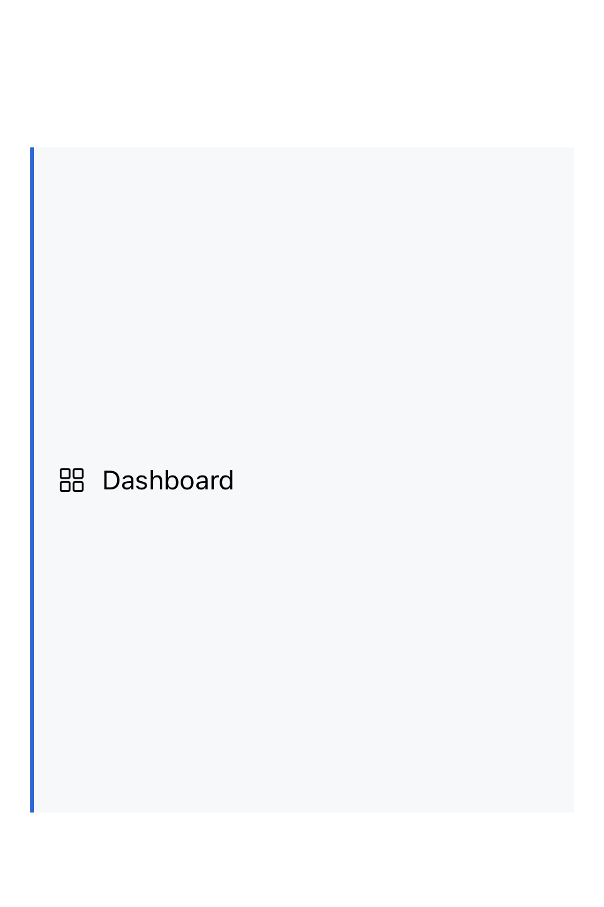

# SidebarRow

侧栏行 / Sidebar navigation row.

## API

| 参数 | 类型 | 默认值 | 说明 |
|---|---|---|---|
| isSelected | Bool | - | 是否处于选中态 |
| label | () -> Label | - | 行内容 |

字符串便利构造：`SidebarRow(_ text: String, isSelected: Bool)`。

## 预览 / Preview



## 使用示例 / Usage

```swift
SidebarRow("Inbox", isSelected: false)
SidebarRow("Pull Requests", isSelected: true)
SidebarRow("Issues", isSelected: false)
SidebarRow(isSelected: false) {
    HStack(spacing: CoreSpacing.sm) {
        Image(systemName: "star.fill")
        Text("Starred")
    }
}
.frame(width: 240)
.background(Color.surfaceSidebar)
```

## 视觉 Token

- 左侧 accent 条：`CoreBorderWidth.thick`（2pt），选中时 `Color.borderFocus`，非选中 `Color.clear`
- 选中 / hover 背景：`Color.surfaceCanvasSubtle`
- 字号：`CoreTypography.bodyMediumFont`
- 文字色：`Color.contentPrimary`
- Padding：`CoreControlMetrics` for `.small`
- 高度：`CoreControlMetrics.height(for: .small)`（28pt 紧凑高度）
- 选中优先级高于 hover，避免视觉抖动
